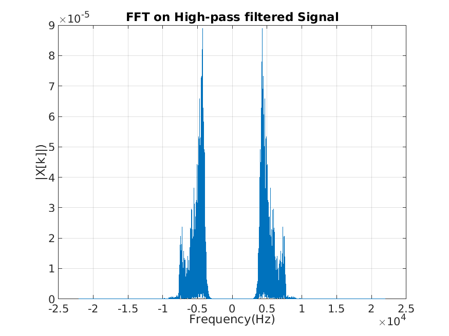

# Coding Assignment Signals and Systems

**By Agam Kashyap : IMT2018004**

***The following assignment has been done in MATLAB.***

The sampling frequency of the signal is 44100 Hz as can be seen by 
``` 
disp(Fs); 
```

**Look at the time domain plot of this audio signal**


If you were to zoom in, you will notice that it is a discrete and an aperiodic signal. This means that the best Fourier representation to analyse it would be **DTFT(Discrete Time Fourier Transform)**. Since this transformation requires an infinte domain which is not feasible, I used **DFT**.

Here is the **Frequency domain plot of the audio signal obtained by performing Fast Fourier Transform**


Now, to apply a filter to the signal I have used an in-built method known as **butter()**.  

**Applying a low pass filter ceiled at 4kHz to signal**


**The inverse fourier transform plot for this signal is obtained as:**


```
The audio file corresponding to this is X_LOW.wav
```

To find the impulse response of the signal, I have utilised the `impz()` function of `MATLAB`. As we can see, the impulse response of the almost ideal filter is a sinc function.


Now, similarly for the highpass filter.
**Applying a high pass filter of 4kHz to signal**



**The inverse Fourier Transform is:**


```
The audio file corresponding to this is X_Hi.wav
```

**The impulse response for the same is**


***References***
- [Youssef Khmou (2020). PSD (Power Spectral Density), and Amplitude Spectrum with adjusted FFT](https://www.mathworks.com/matlabcentral/fileexchange/40002-psd-power-spectral-density-and-amplitude-spectrum-with-adjusted-fft), MATLAB Central File Exchange. Retrieved May 11, 2020.
